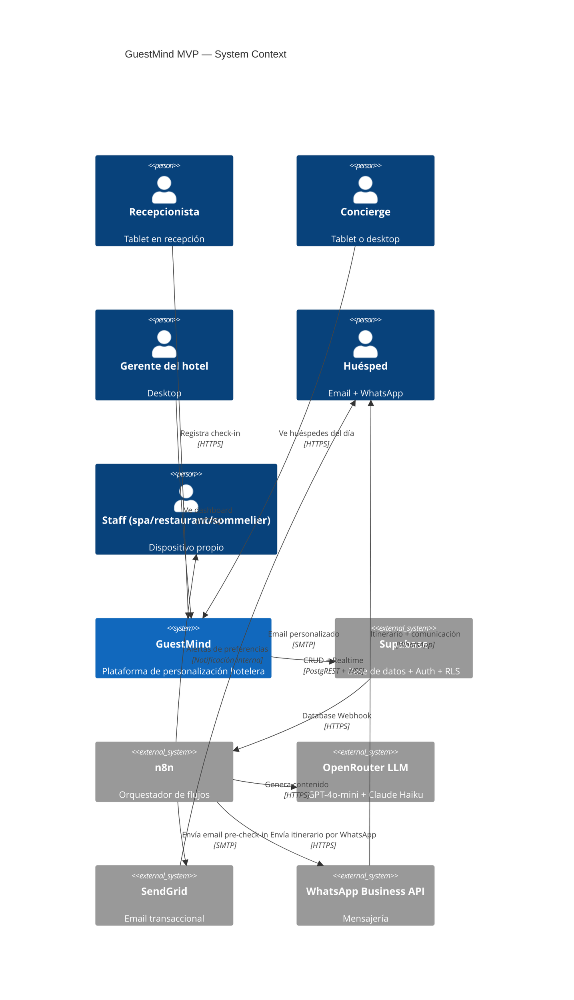
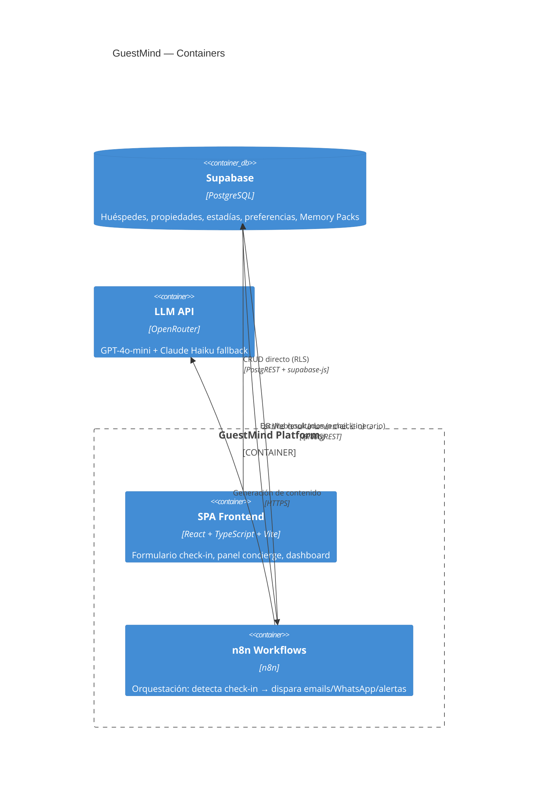

# Arquitectura: GuestMind MVP

**Versión**: 1.0
**Fecha**: 6 de junio de 2026
**Autor**: Hermes Agent · Software House (Solution Architect)
**PRD de origen**: `prd.md` v1.0
**Opción elegida**: B — React SPA + n8n orquestador + Supabase (híbrido)

---

## 1. Stack Tecnológico

| Capa | Tecnología | Justificación |
|---|---|---|
| **Frontend** | React 19 + TypeScript + Vite + Tailwind CSS | SPA rápida, tablet-first, deploy en Vercel. TypeScript para contratos tipados con Supabase |
| **State management** | Zustand | Liviano, sin boilerplate. Suficiente para 3 vistas (check-in, concierge, dashboard) |
| **Routing** | React Router v7 | 3 rutas: `/check-in`, `/concierge`, `/dashboard` |
| **Base de datos** | Supabase (PostgreSQL) | RLS multi-tenant nativo, realtime, auth, storage. Free tier para piloto |
| **Orquestador** | n8n (n8n-dev.niawi.tech → landia.niawi.tech) | 300+ conectores. Solo orquestación y conectores externos, sin lógica de negocio |
| **Email** | SendGrid (vía n8n node) | SMTP confiable, free tier 100 emails/día |
| **WhatsApp** | Evolution API (vía n8n HTTP Request) | WhatsApp Business API ya disponible en el stack de Leo |
| **LLM API** | OpenRouter → GPT-4o-mini (primario) + Claude Haiku (fallback) | API unificada, multi-proveedor sin cambios de código |
| **Deploy frontend** | Vercel | Push a GitHub → deploy automático. Ya probado (Chiví Korá) |
| **CI/CD** | GitHub Actions | Lint + typecheck + tests → Vercel deploy |
| **Monitoreo** | n8n execution logs + Supabase logs | Suficiente para MVP. Grafana en v2 |

---

## 2. Diagrama de Componentes (C4 — Nivel 1: System Context)



### Diagrama de Contenedores (Nivel 2)



---

## 3. Modelo de Dominio

### Bounded Contexts

| Contexto | Responsabilidad | Dueño |
|---|---|---|
| **Check-in** | Captura de datos del huésped, lookup, validación | SPA Frontend |
| **Perfil del huésped** | Enriquecimiento: historial + datos actuales + Memory Pack | n8n workflow |
| **Personalización** | Generación de emails e itinerarios vía LLM | n8n workflow |
| **Comunicación** | Envío de emails (SendGrid) y WhatsApp | n8n workflow |
| **Concierge** | Vista de huéspedes del día, itinerarios | SPA Frontend |
| **Dashboard** | Métricas de upsell, satisfacción, tokens | SPA Frontend |
| **Administración** | Memory Packs, exportación de datos, baja | SPA Frontend |

### Aggregates

```
Guest (aggregate root)
  ├─ GuestId (UUID)
  ├─ PropertyId (FK)
  ├─ PersonalInfo (name, email, document, country, language)
  ├─ Stay[] (check-in date, check-out date, room, group composition, travel reason)
  └─ Preferences (dietary, interests, allergies)

Stay (entity)
  ├─ StayId (UUID)
  ├─ CheckInDate
  ├─ EnrichedProfile (merged history + current + memory pack)
  └─ GeneratedContent (email, itinerary)

Property (aggregate root)
  ├─ PropertyId (UUID)
  ├─ Name
  ├─ Services (spa, restaurant, sommelier — flags)
  └─ MemoryPack[] (segment-based baseline recommendations)

MemoryPack (value object)
  ├─ Segment (honeymoon, family, business, adventure)
  ├─ BaselineRecommendations
  └─ PromptAdditions
```

---

## 4. Contratos de API

### 4.1 Supabase → n8n (Database Webhook)

```
POST https://n8n-dev.niawi.tech/webhook/check-in-detected
Content-Type: application/json

{
  "type": "INSERT",
  "table": "stays",
  "record": {
    "id": "uuid",
    "guest_id": "uuid",
    "property_id": "uuid",
    "check_in_date": "2026-06-10",
    "room_number": "204",
    "group_composition": "couple",
    "travel_reason": "honeymoon"
  }
}

Response 200: { "status": "processing" }
Response 500: { "error": "workflow_failed" }
```

### 4.2 n8n → LLM API (OpenRouter)

```
POST https://openrouter.ai/api/v1/chat/completions
Authorization: Bearer ${OPENROUTER_API_KEY}
Content-Type: application/json

{
  "model": "openai/gpt-4o-mini",
  "messages": [
    { "role": "system", "content": "Eres un concierge de hotel de lujo..." },
    { "role": "user", "content": "Genera un email pre-check-in para {{guest_name}}..." }
  ],
  "temperature": 0.7,
  "max_tokens": 500
}

Response 200: { "choices": [{ "message": { "content": "..." } }] }
Response 429: Rate limit → fallback a "anthropic/claude-3-haiku"
```

### 4.3 Frontend → Supabase (supabase-js)

El frontend solo consume Supabase vía `supabase-js`. No hay API intermedia.

```typescript
// Check-in form submission
const { data, error } = await supabase
  .from('stays')
  .insert({
    guest_id: guestId,
    property_id: currentPropertyId,
    check_in_date: formData.checkInDate,
    room_number: formData.roomNumber,
    group_composition: formData.groupComposition,
    travel_reason: formData.travelReason
  })
  .select()

// Concierge: today's guests
const { data } = await supabase
  .from('stays')
  .select('*, guests(*), enriched_profiles(*)')
  .eq('property_id', currentPropertyId)
  .eq('check_in_date', todayISO)
  .order('created_at', { ascending: false })
```

### 4.4 n8n → Supabase (PostgREST)

n8n escribe resultados de vuelta a Supabase vía HTTP Request node:

```
PATCH https://<supabase-project>.supabase.co/rest/v1/stays?id=eq.<uuid>
apikey: <service_role_key>
Content-Type: application/json

{
  "email_sent_at": "2026-06-03T10:00:00Z",
  "email_content": "...",
  "itinerary_content": "..."
}
```

---

## 5. Modelo de Datos (Supabase)

```sql
-- Propiedades (multi-tenant)
CREATE TABLE properties (
  id UUID PRIMARY KEY DEFAULT gen_random_uuid(),
  name TEXT NOT NULL,
  services JSONB DEFAULT '{"spa": false, "restaurant": false, "sommelier": false}',
  whatsapp_enabled BOOLEAN DEFAULT false,
  created_at TIMESTAMPTZ DEFAULT now()
);

-- Huéspedes
CREATE TABLE guests (
  id UUID PRIMARY KEY DEFAULT gen_random_uuid(),
  property_id UUID NOT NULL REFERENCES properties(id),
  email TEXT NOT NULL,
  document TEXT,
  name TEXT NOT NULL,
  country TEXT,
  language TEXT DEFAULT 'es',
  phone TEXT,
  whatsapp_consent BOOLEAN DEFAULT false,
  created_at TIMESTAMPTZ DEFAULT now(),
  UNIQUE(property_id, email)
);

-- Preferencias del huésped (históricas, acumulativas)
CREATE TABLE preferences (
  id UUID PRIMARY KEY DEFAULT gen_random_uuid(),
  guest_id UUID NOT NULL REFERENCES guests(id),
  dietary_restrictions TEXT[] DEFAULT '{}',
  interests TEXT[] DEFAULT '{}',
  allergies TEXT[] DEFAULT '{}',
  updated_at TIMESTAMPTZ DEFAULT now()
);

-- Estadías (cada visita genera un registro nuevo)
CREATE TABLE stays (
  id UUID PRIMARY KEY DEFAULT gen_random_uuid(),
  guest_id UUID NOT NULL REFERENCES guests(id),
  property_id UUID NOT NULL REFERENCES properties(id),
  check_in_date DATE NOT NULL,
  check_out_date DATE,
  room_number TEXT,
  group_composition TEXT,
  travel_reason TEXT,
  -- Campos generados por n8n
  enriched_profile JSONB,
  email_content TEXT,
  email_sent_at TIMESTAMPTZ,
  itinerary_content TEXT,
  itinerary_generated_at TIMESTAMPTZ,
  created_at TIMESTAMPTZ DEFAULT now()
);

-- Memory Packs (baseline por segmento)
CREATE TABLE memory_packs (
  id UUID PRIMARY KEY DEFAULT gen_random_uuid(),
  property_id UUID NOT NULL REFERENCES properties(id),
  segment TEXT NOT NULL CHECK (segment IN ('honeymoon', 'family', 'business', 'adventure')),
  baseline_recommendations JSONB NOT NULL,
  prompt_additions TEXT,
  updated_at TIMESTAMPTZ DEFAULT now(),
  UNIQUE(property_id, segment)
);

-- Alertas enviadas al staff
CREATE TABLE staff_alerts (
  id UUID PRIMARY KEY DEFAULT gen_random_uuid(),
  property_id UUID NOT NULL REFERENCES properties(id),
  stay_id UUID NOT NULL REFERENCES stays(id),
  service_type TEXT NOT NULL CHECK (service_type IN ('spa', 'restaurant', 'sommelier')),
  preference_matched TEXT,
  sent_at TIMESTAMPTZ DEFAULT now()
);

-- Índices
CREATE INDEX idx_guests_property ON guests(property_id);
CREATE INDEX idx_guests_email ON guests(property_id, email);
CREATE INDEX idx_stays_date ON stays(property_id, check_in_date);
CREATE INDEX idx_stays_guest ON stays(guest_id);
CREATE INDEX idx_preferences_guest ON preferences(guest_id);

-- Row-Level Security
ALTER TABLE properties ENABLE ROW LEVEL SECURITY;
ALTER TABLE guests ENABLE ROW LEVEL SECURITY;
ALTER TABLE stays ENABLE ROW LEVEL SECURITY;
ALTER TABLE preferences ENABLE ROW LEVEL SECURITY;
ALTER TABLE memory_packs ENABLE ROW LEVEL SECURITY;

-- Política: cada propiedad solo ve sus datos
CREATE POLICY property_isolation ON guests
  FOR ALL USING (property_id = current_setting('app.current_property_id')::UUID);
-- (repetir para stays, preferences, memory_packs)
```

---

## 6. Decisiones de Arquitectura (ADR)

### ADR-001: Frontend consume Supabase directo (sin API intermedia)

**Contexto**: El frontend necesita consultar y escribir datos de huéspedes, estadías y preferencias. La alternativa era una API FastAPI intermedia.

**Decisión**: El frontend usa `supabase-js` directamente con RLS por propiedad.

**Consecuencias**:
- ✅ Desarrollo más rápido: sin capa de API que mantener
- ✅ RLS garantiza aislamiento multi-tenant sin código
- ✅ Menos latencia: consultas directas a PostgREST
- ❌ Lógica de negocio en el frontend (validaciones, transformaciones)
- ❌ Migrar a backend propio requiere refactor del data access layer
- 🔮 Mitigación: el frontend tendrá un `data/` layer que encapsula llamadas a Supabase. Cambiar a API solo requiere cambiar ese layer.

### ADR-002: n8n como orquestador puro (sin lógica de negocio)

**Contexto**: n8n podría hacer el enriquecimiento de perfiles (merge de datos). La alternativa es hacerlo en el frontend o en un backend.

**Decisión**: n8n solo orquesta: recibe webhook, dispara llamadas en paralelo, enruta resultados. La lógica de enriquecimiento se implementa en un n8n Code node (JavaScript), no en nodos visuales.

**Consecuencias**:
- ✅ n8n workflows simples (< 15 nodos), fáciles de mantener
- ✅ Si hay que migrar a FastAPI, la lógica del Code node se copia directo
- ❌ Debugging de JavaScript en n8n es limitado
- 🔮 Si la lógica crece > 50 líneas, extraer a micro-API

### ADR-003: OpenRouter como proxy unificado de LLMs

**Contexto**: Necesitamos fallback multi-proveedor (GPT-4o-mini → Claude Haiku).

**Decisión**: Usar OpenRouter como API unificada. n8n hace una sola integración HTTP. El fallback se configura en n8n con un Error Trigger + Switch node.

**Consecuencias**:
- ✅ Un solo endpoint, un solo formato de request/response
- ✅ Cambiar o agregar proveedores sin tocar código
- ❌ Dependencia de un tercero adicional (OpenRouter)
- ❌ Latencia extra (~100ms) por el proxy
- 🔮 Si OpenRouter falla, n8n tiene respaldo directo a OpenAI/Anthropic como tercer nivel

### ADR-004: SPA sin SSR

**Contexto**: Next.js ofrece SSR/SSG, pero agrega complejidad de deploy y runtime.

**Decisión**: React + Vite SPA pura. Sin servidor Node.js en producción.

**Consecuencias**:
- ✅ Deploy trivial: archivos estáticos en Vercel
- ✅ Sin cold starts, sin edge functions
- ❌ Sin SEO (irrelevante: es una app interna del hotel, no indexable)
- ❌ Carga inicial más lenta en tablets lentas (mitigado con code splitting)

---

## 7. Infraestructura y Deploy

### Entornos

| Entorno | Frontend | n8n | Supabase |
|---|---|---|---|
| **Dev** | `localhost:5173` | `n8n-dev.niawi.tech` | Proyecto dev |
| **Prod** | `guestmind.vercel.app` | `landia.niawi.tech` | Proyecto prod |

### CI/CD Pipeline (GitHub Actions)

```yaml
name: GuestMind CI/CD
on:
  push:
    branches: [main]
  pull_request:
    branches: [main]

jobs:
  quality:
    runs-on: ubuntu-latest
    steps:
      - uses: actions/checkout@v4
      - uses: actions/setup-node@v4
      - run: npm ci
      - run: npm run typecheck
      - run: npm run lint
      - run: npm test

  deploy:
    needs: quality
    if: github.ref == 'refs/heads/main'
    runs-on: ubuntu-latest
    steps:
      - uses: actions/checkout@v4
      - run: npm ci && npm run build
      - uses: amondnet/vercel-action@v25
        with:
          vercel-token: ${{ secrets.VERCEL_TOKEN }}
          vercel-org-id: ${{ secrets.VERCEL_ORG_ID }}
          vercel-project-id: ${{ secrets.VERCEL_PROJECT_ID }}
          vercel-args: '--prod'
```

### n8n Workflow Deploy

Los workflows de n8n se exportan como JSON y se versionan en `n8n/workflows/`. Para deploy:
```bash
# Importar a n8n vía REST API
curl -X POST https://landia.niawi.tech/rest/workflows \
  -H "X-N8N-API-KEY: $N8N_API_KEY" \
  -d @n8n/workflows/wf-check-in-detected.json
```

---

## 8. Riesgos Técnicos y Spikes

| ID | Riesgo | Prob | Impacto | Mitigación | Spike |
|---|---|---|---|---|---|
| RT-01 | Supabase Database Webhooks no son confiables (latencia, pérdida) | Media | Alto | Usar polling cada 30s como fallback en n8n | Sem 1: test de webhooks con 100 inserts/sec |
| RT-02 | RLS policies complejas degradan queries | Baja | Medio | Test de carga con 5 propiedades y 1000 huéspedes cada una | Sem 2 |
| RT-03 | WhatsApp Business API requiere aprobación de Meta (demora) | Alta | Bajo | Priorizar email. WhatsApp es Should have | No bloquea |
| RT-04 | n8n Code node (JS) se vuelve difícil de mantener si crece | Media | Medio | Límite auto-impuesto: 50 líneas por Code node. Extraer a micro-API si supera | Monitoreo continuo |
| RT-05 | Vite SPA tarda > 3s en cargar en tablet económica | Media | Medio | Code splitting + lazy loading + bundle analysis | Sem 2: test en tablet real o simulada |

---

## 9. Critical Points (para Error Handler)

```yaml
client: guestmind
critical_points:
  - id: CP-001
    name: check_in_form_unavailable
    severity: P1
    description: El formulario de check-in no carga o no persiste datos
    impact: El recepcionista no puede registrar huéspedes. Operación del hotel detenida.
    playbook:
      pattern: "Supabase.*timeout|connection refused|500.*stays"
      auto_fix: null  # Requiere intervención manual
      notify: "telegram:leo"

  - id: CP-002
    name: email_pre_checkin_not_sent
    severity: P2
    description: n8n no envía email pre-check-in después de un check-in exitoso
    impact: El huésped no recibe personalización previa. Experiencia degradada.
    playbook:
      pattern: "SendGrid.*error|SMTP.*timeout|wf-send-email.*failed"
      auto_fix: |
        1. Verificar SendGrid API key en n8n credentials
        2. Reintentar envío (n8n retry on failure)
        3. Si falla 3 veces, notificar a Leo

  - id: CP-003
    name: llm_provider_down
    severity: P2
    description: Ambos proveedores LLM (primario + fallback) fallan
    impact: No se generan emails ni itinerarios. El perfil queda sin contenido personalizado.
    playbook:
      pattern: "OpenRouter.*429|OpenRouter.*timeout|anthropic.*429"
      auto_fix: |
        1. Intentar proveedor terciario (OpenAI directo como último recurso)
        2. Encolar tarea para reintento en 15 min
        3. Notificar a Leo si 3 check-ins consecutivos sin LLM

  - id: CP-004
    name: concierge_panel_slow
    severity: P3
    description: El panel del concierge tarda > 3s en cargar
    impact: Molestia menor. El concierge espera unos segundos.
    playbook:
      pattern: "query.*stays.*slow|supabase.*latency"
      auto_fix: null  # Solo loguear y revisar índices
```

---

## 10. Tests Esperados (TDD de Pipeline)

### Contrato: Formulario de Check-in → Supabase

| # | Caso | Input | Esperado |
|---|---|---|---|
| T01 | Check-in exitoso | Datos completos de huésped nuevo | INSERT en guests + stays, status 201 |
| T02 | Email ya registrado (misma propiedad) | Email duplicado | Precarga perfil previo, no crea guest nuevo |
| T03 | Email nuevo (otra propiedad) | Email no registrado en esta propiedad | Crea guest nuevo + stay |
| T04 | Campo obligatorio vacío | name = "" | Error de validación, no INSERT |
| T05 | RLS: consulta de propiedad A no ve datos de B | query con property_id B | Retorna [] |

### Contrato: n8n Webhook → Flujo de Check-in

| # | Caso | Input | Esperado |
|---|---|---|---|
| T06 | Check-in detectado → flujo completo | DB Webhook con stay nuevo | Email enviado, itinerario generado, alertas (si aplica) |
| T07 | LLM primario falla | Simular timeout GPT-4o-mini | Fallback a Claude Haiku, email enviado |
| T08 | Ambos LLM fallan | Simular timeout en ambos | Error registrado, tarea encolada, notificación a Leo |
| T09 | Huésped sin WhatsApp consent | whatsapp_consent = false | Solo email, no WhatsApp |
| T10 | Hotel sin servicio spa | services.spa = false | No se envía alerta a spa aunque guest tenga preferencia |

### End-to-End

| # | Flujo | Resultado esperado |
|---|---|---|
| E2E-01 | Check-in huésped nuevo → email pre-check-in → panel concierge | Email en idioma del huésped, itinerario visible en panel |
| E2E-02 | Check-in huésped recurrente → perfil enriquecido | Historial previo visible + datos nuevos fusionados |
| E2E-03 | Gerente exporta datos → descarga CSV | Archivo con todos los datos de la propiedad en < 5 min |
| E2E-04 | Cancelación de licencia → eliminación de datos | Datos exportados y eliminados de Supabase en 30 días |

---

*Arquitectura generada según skills `solution-architect` v1.0 + `technology-evaluation` v1.0 + `technology-stacks` v1.0. Opción B elegida por Leo.*
