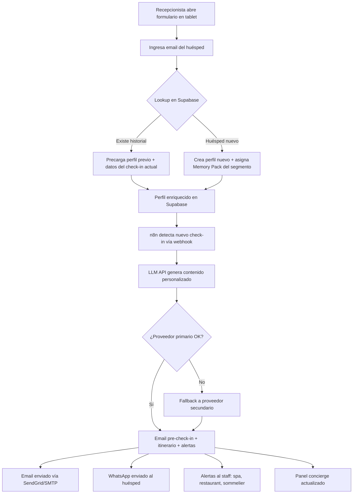

# PRD: GuestMind MVP

**Versión**: 1.0
**Fecha**: 6 de junio de 2026
**Autor**: Hermes Agent · Software House
**Cliente**: GuestMind (contacto@guestmind.ai)
**Brief de origen**: `Brief_GuestMind_MVP.docx` (Brief Comercial v1.0, marzo 2026)
**Score del brief**: 5/5 — PRD directo sin clarificación previa

---

## 1. OBJETIVOS

### 1.1 Problema que resuelve

Los resorts y hoteles all-inclusive en Latinoamérica carecen de herramientas de personalización de huéspedes que no expongan sus datos a terceros, no dependan de conectividad crítica, y no cobren costos variables por huésped. Las alternativas actuales (Revinate, Cendyn) generan vendor lock-in del conocimiento acumulado y facturan por volumen, haciendo que el costo escale con el éxito.

### 1.2 Propuesta de valor

> Para resorts all-inclusive en Latinoamérica que necesitan personalizar la experiencia de cada huésped sin perder soberanía sobre sus datos, GuestMind es una plataforma de personalización hotelera que enriquece el perfil del huésped desde el primer check-in combinando historial previo + datos actuales, con precio fijo anual, sin costos variables, y con camino garantizado a on-premise.

### 1.3 Métricas de éxito (KPIs)

| KPI | Línea base | Meta MVP | Plazo de medición |
|-----|-----------|----------|-------------------|
| Tasa de apertura email pre-check-in | ~20% (industria) | >45% | 60 días post-instalación |
| Gasto promedio por estadía (upsell) | Baseline del hotel piloto | +15% en segmentos personalizados | 60 días post-instalación |
| NPS post-estadía | Baseline del hotel piloto | +8 puntos | 60 días post-instalación |
| Tiempo de check-in con formulario | ~5 min (manual) | <3 min | Desde día 1 |
| Incidentes de privacidad / fuga de datos | N/A | 0 | Continuo |
| Costo de tokens LLM por huésped | N/A (nuevo) | <$0.005 USD | Mensual |
| Lookup de huésped previo | N/A | <1 segundo | Desde día 1 |

---

## 2. STAKEHOLDERS & ACTORES

| Actor | Rol | Necesidad principal | Entorno |
|-------|-----|--------------------|--------|
| **Recepcionista** | Opera el check-in | Capturar datos del huésped rápido (<3 min) sin errores | Tablet en recepción |
| **Concierge** | Atiende al huésped durante la estadía | Ver itinerario personalizado del día y preferencias | Tablet o desktop |
| **Staff de spa / restaurant / sommelier** | Recibe alertas de upsell | Saber qué huéspedes tienen preferencias relevantes para su área | Dispositivo propio o pantalla compartida |
| **Huésped** | Recibe la personalización | Recibir emails pre-check-in en su idioma y comunicación por WhatsApp | Email, WhatsApp |
| **Gerente del hotel** | Decide contratar y monitorea resultados | Ver dashboard de métricas (upsell, satisfacción) | Desktop |
| **GuestMind (admin)** | Opera la plataforma | Gestionar propiedades, Memory Packs, monitoreo de tokens | Desktop |
| **Legal / DPO** | Garantiza cumplimiento normativo | Asegurar GDPR/LGPD vía DPA y políticas de retención | Desktop |

---

## 3. ALCANCE

### 3.1 In-Scope (MVP)

- Formulario web responsive de check-in (tablet-first)
- Lookup de huésped previo por email o documento en Supabase
- Persistencia de datos de check-in en Supabase con Row-Level Security por propiedad
- Perfil enriquecido: historial previo + datos del check-in actual + Memory Pack del segmento
- Motor de IA multi-proveedor con fallback automático (proveedor primario + secundario)
- Generación de email pre-check-in personalizado en el idioma del huésped (3-7 días antes)
- Orquestación de flujos vía n8n (emails, alertas internas, WhatsApp)
- Integración WhatsApp Business API para comunicación con el huésped
- Panel mínimo del concierge: vista de huéspedes del día con perfil e itinerario
- Alertas internas al staff (spa, restaurant, sommelier) según preferencias del huésped
- Dashboard básico de métricas (upsell, satisfacción, costo de tokens)
- 4 Memory Packs pre-configurados para segmentos de huéspedes
- Exportación de datos del hotel (CSV/JSON) en cualquier momento
- Multiidioma sin límite en la generación de contenido
- DPA estándar incluido en contrato de licencia
- Cifrado en reposo y en tránsito en Supabase

### 3.2 Out-of-Scope (v2 o posterior)

- Modelo LLM corriendo on-premise en servidor del hotel (v2)
- Operación sin conexión a internet (v2 on-premise)
- Integración con Opera PMS o Cloudbeds vía API/OHIP (v2)
- Gestión de reservas y disponibilidad de habitaciones
- Sistema de pagos (procesamiento de tarjetas, facturación)
- Housekeeping y mantenimiento de habitaciones
- Reportes y analytics avanzados (más allá del dashboard básico)
- App nativa mobile (iOS/Android)
- Múltiples propiedades en plan Starter (solo disponible en Pro/Enterprise)
- Memory Packs a medida por cliente (v2 Enterprise)
- Certificación GDPR/LGPD by-design estructural (v2 on-premise)
- Agente estratega de revenue (solo disponible en plan Pro)

---

## 4. USER STORIES

### US-001: Recepcionista captura datos de check-in

**Como** recepcionista
**Quiero** registrar los datos del huésped en un formulario web responsive desde una tablet
**Para** completar el check-in en menos de 3 minutos sin errores de transcripción

**Prioridad**: Must have
**Estimación**: 8 story points
**Dependencias**: Configuración de Supabase (US-007)

**Criterios de aceptación (Gherkin):**
- [ ] **DADO** que el recepcionista abre el formulario en una tablet **CUANDO** ingresa nombre, país, idioma, motivo de viaje, composición del grupo, fechas y número de habitación **ENTONCES** el sistema valida los campos obligatorios y muestra confirmación visual de éxito
- [ ] **DADO** que un campo obligatorio está vacío **CUANDO** el recepcionista intenta enviar el formulario **ENTONCES** el sistema marca el campo en rojo con mensaje de error y no permite el envío
- [ ] **DADO** que el formulario es accedido desde una tablet de 10" **CUANDO** el recepcionista navega por los campos **ENTONCES** todos los elementos son legibles y los botones tienen tamaño adecuado para touch (mín 44x44px)

---

### US-002: Lookup de huésped previo

**Como** recepcionista
**Quiero** buscar al huésped por email o documento al iniciar el check-in
**Para** saber si ya estuvo alojado antes y precargar su perfil sin preguntarle todo de nuevo

**Prioridad**: Must have
**Estimación**: 5 story points
**Dependencias**: US-007 (Supabase), US-001 (formulario)

**Criterios de aceptación (Gherkin):**
- [ ] **DADO** que el recepcionista ingresa un email registrado en Supabase **CUANDO** hace clic en "Buscar" **ENTONCES** el sistema precarga los datos del perfil previo en el formulario en menos de 1 segundo
- [ ] **DADO** que el recepcionista ingresa un email NO registrado **CUANDO** hace clic en "Buscar" **ENTONCES** el sistema muestra "Huésped nuevo" y presenta el formulario vacío para crear un registro nuevo
- [ ] **DADO** que hay múltiples huéspedes con el mismo documento (raro pero posible) **CUANDO** el sistema encuentra más de un resultado **ENTONCES** muestra una lista para que el recepcionista seleccione el correcto

---

### US-003: Perfil enriquecido del huésped

**Como** sistema
**Quiero** combinar el historial previo del huésped con los datos del check-in actual y el Memory Pack de su segmento
**Para** generar un perfil completo que alimente la personalización sin intervención manual del staff

**Prioridad**: Must have
**Estimación**: 5 story points
**Dependencias**: US-001, US-002, US-007, US-006 (Memory Packs)

**Criterios de aceptación (Gherkin):**
- [ ] **DADO** que un huésped con historial previo hace check-in **CUANDO** se completa el formulario **ENTONCES** el sistema fusiona automáticamente los datos históricos (preferencias, estadías anteriores) con los datos nuevos del check-in
- [ ] **DADO** que un huésped nuevo (sin historial) hace check-in **CUANDO** se completa el formulario **ENTONCES** el sistema crea un perfil nuevo y le asigna el Memory Pack correspondiente a su segmento (motivo de viaje, composición del grupo)
- [ ] **DADO** que el perfil está enriquecido **CUANDO** el concierge accede al panel **ENTONCES** ve las preferencias relevantes del huésped (idioma, restricciones alimentarias, intereses) sin necesidad de buscarlas manualmente

---

### US-004: Generación de email pre-check-in personalizado

**Como** huésped
**Quiero** recibir un email antes de mi llegada con información relevante en mi idioma
**Para** sentir que el hotel me conoce y preparó mi estadía antes de que llegue

**Prioridad**: Must have
**Estimación**: 8 story points
**Dependencias**: US-003 (perfil enriquecido), US-009 (LLM API), US-008 (n8n orquestación)

**Criterios de aceptación (Gherkin):**
- [ ] **DADO** que un huésped tiene check-in programado en 3-7 días **CUANDO** n8n dispara el flujo pre-check-in **ENTONCES** el LLM genera un email personalizado en el idioma del huésped (detectado del perfil) y lo envía vía SendGrid/SMTP
- [ ] **DADO** que el huésped habla portugués **CUANDO** se genera el email **ENTONCES** el contenido está en portugués brasileño correcto, incluyendo nombres de servicios y actividades
- [ ] **DADO** que el proveedor primario de LLM falla (timeout o error) **CUANDO** se intenta generar el email **ENTONCES** el sistema hace fallback automático al proveedor secundario y el email se envía sin demora perceptible

---

### US-005: Panel del concierge — huéspedes del día

**Como** concierge
**Quiero** ver una lista de los huéspedes del día con su perfil e itinerario personalizado
**Para** anticipar sus necesidades y ofrecer un servicio proactivo sin tener que buscar información en múltiples lugares

**Prioridad**: Must have
**Estimación**: 5 story points
**Dependencias**: US-003 (perfil enriquecido), US-010 (generación de itinerario)

**Criterios de aceptación (Gherkin):**
- [ ] **DADO** que el concierge abre el panel en la mañana **CUANDO** carga la vista del día **ENTONCES** ve la lista de huéspedes con check-in hoy, cada uno con su nombre, país, idioma, motivo de viaje, preferencias destacadas e itinerario generado
- [ ] **DADO** que no hay huéspedes con check-in hoy **CUANDO** el concierge abre el panel **ENTONCES** ve un mensaje "Sin huéspedes hoy" con la fecha visible
- [ ] **DADO** que el concierge hace clic en un huésped **CUANDO** se expande la vista **ENTONCES** ve el perfil completo con historial de estadías previas (si las hay) y el detalle del itinerario

---

### US-006: Memory Packs — segmentos pre-configurados

**Como** sistema
**Quiero** disponer de 4 Memory Packs pre-configurados por segmento de huésped
**Para** enriquecer perfiles nuevos (primera estadía) con recomendaciones baseline sin depender de historial previo

**Prioridad**: Should have
**Estimación**: 3 story points
**Dependencias**: US-007 (Supabase)

**Criterios de aceptación (Gherkin):**
- [ ] **DADO** que un huésped nuevo es clasificado en un segmento (ej: luna de miel, familia, negocios, aventura) **CUANDO** se crea su perfil **ENTONCES** el sistema asigna automáticamente el Memory Pack correspondiente con recomendaciones baseline para ese segmento
- [ ] **DADO** que el hotel tiene múltiples huéspedes del mismo segmento **CUANDO** se generan perfiles **ENTONCES** cada huésped recibe el mismo Memory Pack como punto de partida, que se personaliza con los datos del check-in actual
- [ ] **DADO** que un Memory Pack se actualiza (ej: nueva actividad disponible) **CUANDO** se modifica en Supabase **ENTONCES** los nuevos check-ins usan la versión actualizada sin afectar perfiles ya generados

---

### US-007: Configuración de Supabase — tablas, RLS, políticas

**Como** administrador GuestMind
**Quiero** tener un schema de Supabase configurado con tablas de huéspedes, propiedades, estadías, preferencias y Memory Packs, con Row-Level Security por propiedad
**Para** que cada hotel solo vea sus propios datos y la plataforma sea multi-tenant desde el día 1

**Prioridad**: Must have
**Estimación**: 5 story points
**Dependencias**: Ninguna (infraestructura base)

**Criterios de aceptación (Gherkin):**
- [ ] **DADO** que el recepcionista del Hotel A consulta la lista de huéspedes **CUANDO** la query se ejecuta en Supabase **ENTONCES** solo ve huéspedes de su propiedad, sin acceso a datos de otros hoteles
- [ ] **DADO** que un huésped tiene datos en Supabase **CUANDO** se almacenan **ENTONCES** los datos están cifrados en reposo (AES-256) y en tránsito (TLS 1.3)
- [ ] **DADO** que el hotel solicita la exportación de sus datos **CUANDO** se ejecuta la exportación **ENTONCES** el sistema entrega CSV/JSON con todos los datos de esa propiedad en menos de 5 minutos

---

### US-008: Orquestación de flujos con n8n

**Como** sistema
**Quiero** que n8n orqueste automáticamente los flujos de personalización al detectar un nuevo check-in
**Para** que el staff no tenga que disparar manualmente emails, alertas ni generación de itinerarios

**Prioridad**: Must have
**Estimación**: 8 story points
**Dependencias**: US-007 (Supabase), US-009 (LLM API)

**Criterios de aceptación (Gherkin):**
- [ ] **DADO** que un nuevo check-in se persiste en Supabase **CUANDO** n8n detecta el evento (webhook o polling) **ENTONCES** dispara en paralelo: (a) generación de itinerario vía LLM, (b) alertas al staff de spa/restaurant/sommelier si aplica, (c) programación de email pre-check-in según fecha de llegada
- [ ] **DADO** que el LLM falla en la generación del itinerario **CUANDO** n8n recibe el error **ENTONCES** reintenta con el proveedor de fallback y notifica al administrador GuestMind solo si ambos fallan
- [ ] **DADO** que el hotel tiene WhatsApp Business API configurado **CUANDO** se genera el itinerario **ENTONCES** n8n envía el itinerario al huésped por WhatsApp (además del email)

---

### US-009: Motor LLM multi-proveedor con fallback

**Como** sistema
**Quiero** llamar a un LLM vía API unificada con proveedor primario y secundario configurables
**Para** generar contenido personalizado (emails, itinerarios, recomendaciones) tolerante a fallos del proveedor

**Prioridad**: Must have
**Estimación**: 8 story points
**Dependencias**: US-003 (perfil enriquecido)

**Criterios de aceptación (Gherkin):**
- [ ] **DADO** que el proveedor primario (ej: OpenAI GPT-4o-mini) está disponible **CUANDO** se solicita generar un email pre-check-in **ENTONCES** el sistema usa ese proveedor y responde en <3 segundos
- [ ] **DADO** que el proveedor primario devuelve error 429 (rate limit) o timeout **CUANDO** se detecta la falla **ENTONCES** el sistema hace fallback automático al proveedor secundario (ej: Anthropic Claude Haiku) en <500ms adicionales
- [ ] **DADO** que ambos proveedores fallan **CUANDO** se agotan los reintentos **ENTONCES** el sistema notifica al administrador GuestMind y encola la tarea para reintento programado
- [ ] **DADO** que se generan 25.000 interacciones en un año **CUANDO** se mide el costo **ENTONCES** el costo total de tokens no supera los $125 USD anuales por propiedad (asumiendo ~500 tokens por interacción con GPT-4o-mini a $0.15/1M tokens)

---

### US-010: Generación de itinerario personalizado

**Como** concierge
**Quiero** que el sistema genere automáticamente un itinerario personalizado para cada huésped basado en su perfil
**Para** entregarle una propuesta de actividades sin tener que armarla manualmente

**Prioridad**: Should have
**Estimación**: 5 story points
**Dependencias**: US-003 (perfil enriquecido), US-009 (LLM API), US-006 (Memory Packs)

**Criterios de aceptación (Gherkin):**
- [ ] **DADO** que un huésped tiene perfil enriquecido (historial + check-in + Memory Pack) **CUANDO** se dispara la generación de itinerario **ENTONCES** el LLM produce un itinerario en el idioma del huésped con actividades relevantes a su segmento y preferencias
- [ ] **DADO** que el huésped tiene restricciones alimentarias registradas **CUANDO** se genera el itinerario **ENTONCES** las recomendaciones de restaurantes y menúes respetan esas restricciones
- [ ] **DADO** que el itinerario se generó exitosamente **CUANDO** el concierge ve el panel del día **ENTONCES** el itinerario aparece junto al perfil del huésped en un formato legible y accionable

---

### US-011: Integración WhatsApp Business API

**Como** huésped
**Quiero** comunicarme con el concierge por WhatsApp durante mi estadía
**Para** hacer consultas, reservar servicios o recibir recomendaciones sin usar una app nueva

**Prioridad**: Should have
**Estimación**: 5 story points
**Dependencias**: US-005 (panel concierge), US-008 (n8n)

**Criterios de aceptación (Gherkin):**
- [ ] **DADO** que el hotel tiene WhatsApp Business API configurado **CUANDO** un huésped envía un mensaje **ENTONCES** el concierge lo recibe en el panel y puede responder desde la misma interfaz
- [ ] **DADO** que el sistema genera un itinerario para el huésped **CUANDO** n8n procesa el flujo **ENTONCES** el itinerario se envía automáticamente por WhatsApp al número registrado del huésped
- [ ] **DADO** que el huésped no tiene WhatsApp o no autorizó el contacto por ese canal **CUANDO** se intenta enviar **ENTONCES** el sistema usa solo email y no fuerza el envío por WhatsApp

---

### US-012: Alertas internas al staff (upsell)

**Como** staff de spa / restaurant / sommelier
**Quiero** recibir alertas cuando un huésped con preferencias relevantes para mi área hace check-in
**Para** ofrecerle proactivamente servicios que sé que le interesan

**Prioridad**: Could have
**Estimación**: 5 story points
**Dependencias**: US-003 (perfil enriquecido), US-008 (n8n)

**Criterios de aceptación (Gherkin):**
- [ ] **DADO** que un huésped con preferencia "masajes" hace check-in **CUANDO** n8n procesa el perfil **ENTONCES** el staff de spa recibe una alerta con el nombre del huésped, número de habitación y preferencia específica
- [ ] **DADO** que un huésped no tiene preferencias de spa registradas **CUANDO** se procesa su check-in **ENTONCES** el staff de spa no recibe ninguna alerta (sin falsos positivos)
- [ ] **DADO** que el hotel no tiene servicio de spa **CUANDO** se configura el sistema **ENTONCES** las alertas de spa están deshabilitadas para esa propiedad

---

### US-013: Dashboard básico de métricas

**Como** gerente del hotel
**Quiero** ver un dashboard con las métricas clave de GuestMind (upsell, satisfacción, tasa de apertura)
**Para** justificar el retorno de inversión y detectar oportunidades de mejora

**Prioridad**: Should have
**Estimación**: 5 story points
**Dependencias**: US-004 (email), US-005 (panel concierge), US-007 (Supabase)

**Criterios de aceptación (Gherkin):**
- [ ] **DADO** que el gerente accede al dashboard **CUANDO** selecciona un rango de fechas **ENTONCES** ve: tasa de apertura de emails, gasto promedio por estadía (si el hotel carga ese dato), NPS (si se mide), y costo de tokens acumulado
- [ ] **DADO** que el hotel tiene menos de 30 días de uso **CUANDO** el gerente ve el dashboard **ENTONCES** el sistema muestra los datos disponibles sin error y una indicación de que las métricas comparativas requieren más datos
- [ ] **DADO** que el gerente quiere exportar los datos del dashboard **CUANDO** hace clic en "Exportar" **ENTONCES** el sistema descarga un CSV con los datos del período seleccionado

---

### US-014: Exportación y baja de datos del hotel

**Como** gerente del hotel
**Quiero** exportar todos mis datos en cualquier momento y que se eliminen de Supabase si cancelo la licencia
**Para** tener control total sobre mi activo de conocimiento sin vendor lock-in

**Prioridad**: Must have
**Estimación**: 3 story points
**Dependencias**: US-007 (Supabase)

**Criterios de aceptación (Gherkin):**
- [ ] **DADO** que el gerente solicita la exportación **CUANDO** hace clic en "Exportar datos" **ENTONCES** el sistema entrega un archivo CSV/JSON con todos los perfiles, historiales, preferencias y métricas de esa propiedad en menos de 5 minutos
- [ ] **DADO** que el hotel cancela la licencia **CUANDO** GuestMind procesa la baja **ENTONCES** el sistema entrega los datos al hotel y los elimina de Supabase en un plazo máximo de 30 días, con confirmación por escrito
- [ ] **DADO** que la exportación está en curso **CUANDO** otro usuario de la misma propiedad intenta exportar simultáneamente **ENTONCES** el sistema informa que ya hay una exportación en proceso y notifica cuando termine

---

## 5. REQUISITOS NO FUNCIONALES [NFR]

| ID | Categoría | Requisito | Criterio de aceptación |
|----|----------|-----------|----------------------|
| NFR-01 | Performance | Lookup de huésped previo < 1 segundo | Medido desde que el recepcionista presiona "Buscar" hasta que se muestra el resultado, con Supabase en región más cercana al hotel |
| NFR-02 | Performance | Generación LLM < 3 segundos para email/itinerario | Medido desde que se envía el prompt hasta que se recibe la respuesta completa del LLM API |
| NFR-03 | Performance | Panel del concierge sin latencia perceptible | Carga inicial de la vista del día en < 2 segundos con hasta 50 huéspedes |
| NFR-04 | Seguridad | Row-Level Security por propiedad | Test automatizado: query del Hotel A no retorna datos del Hotel B en ningún endpoint |
| NFR-05 | Seguridad | Cifrado en tránsito TLS 1.3 | Verificado en todas las conexiones: cliente↔Supabase, n8n↔LLM API, email↔SMTP |
| NFR-06 | Seguridad | Cifrado en reposo AES-256 en Supabase | Supabase managed service lo garantiza; verificar en documentación del proveedor |
| NFR-07 | Privacidad | DPA estándar incluido en contrato | DPA revisado por legal antes del primer piloto; cubre GDPR, LGPD, Ley 25.326 |
| NFR-08 | Privacidad | Datos exportables y eliminables | Test de exportación completa + test de eliminación en 30 días post-cancelación |
| NFR-09 | Disponibilidad | Fallback multi-proveedor LLM < 500ms adicionales | Medido en tests de inyección de fallos: timeout en primario → secundario responde en < 500ms extra |
| NFR-10 | Disponibilidad | Supabase uptime ≥ 99.9% | Depende del plan de Supabase; para producción evaluar plan Pro ($25/mes) |
| NFR-11 | Escalabilidad | Soporte inicial para 1 propiedad piloto, escalable a 5 en GTM | Schema multi-tenant por diseño; RLS por propiedad no se degrada con +hoteles |
| NFR-12 | Costos | Tokens LLM < $0.005 USD por huésped | Con GPT-4o-mini a $0.15/1M tokens input + ~500 tokens/interacción × 5 interacciones = ~$0.001 |

---

## 6. FLUJO DE DATOS

Diagrama del happy path principal — desde el check-in hasta la personalización entregada:

---

## 7. RESTRICCIONES & SUPUESTOS

### 7.1 Restricciones

| Tipo | Descripción | Impacto |
|------|------------|--------|
| Plataforma | Web responsive únicamente (tablet-first para check-in). Sin apps nativas en MVP | Limita la experiencia mobile del concierge, pero tablets cumplen |
| Conectividad | Requiere internet para LLM API y Supabase. No funciona offline | Crítico para hoteles en destinos remotos. Mitigado eligiendo piloto con conectividad estable |
| Tiempo | MVP en 4 semanas | Comprime el alcance a Must have + algunos Should have |
| Presupuesto infra | Supabase free tier ($0) para piloto, n8n cloud ($20/mes), LLM tokens (~$125/año) | Bajo riesgo. Si el piloto escala a 5 hoteles, migrar Supabase a plan Pro ($25/mes) |
| Presupuesto desarrollo | [PENDIENTE: no definido en el brief] | Requiere definición antes del kickoff |
| LLM proveedor | Sin modelo local. Dependencia total de APIs externas (OpenAI, Anthropic) | Riesgo de costos y disponibilidad. Mitigado con multi-proveedor |
| PMS | Sin integración con Opera/Cloudbeds en MVP. Plataforma propia de check-in | El hotel piloto debe aceptar usar el formulario de GuestMind en paralelo a su PMS actual |
| Regulatorio | DPA requerido antes del piloto. GDPR/LGPD aplican si hay huéspedes europeos/brasileños | Bloqueante legal. Sin DPA firmado no se puede iniciar el piloto |

### 7.2 Supuestos

- El hotel piloto tiene conectividad a internet estable (no es un destino 100% remoto)
- El staff del hotel está dispuesto a usar un formulario digital en tablet (cambio de proceso manual a digital)
- Los datos históricos del hotel piloto existen en algún formato migrable (CSV, Excel, o PMS exportable)
- El hotel piloto ya tiene WhatsApp Business API o está dispuesto a configurarlo (solo para features Should have)
- El presupuesto de desarrollo será definido por Leo/Software House
- Los Memory Packs iniciales (4 segmentos) los define GuestMind con el BA; el equipo de desarrollo los carga

---

## 8. RIESGOS

| ID | Riesgo | Probabilidad | Impacto | Mitigación |
|----|--------|-------------|--------|-----------|
| R-01 | **Privacidad**: datos en cloud vs. promesa on-premise — resistencia de hoteles a ceder datos a la nube | Alta | Crítico | DPA en contrato desde día 1 · Roadmap on-premise público · Cifrado en reposo y tránsito · Cláusula de eliminación en 30 días |
| R-02 | **Conectividad**: hotel piloto con internet inestable → LLM API inaccesible → sistema caído | Alta | Alto | Estrategia multi-proveedor con fallback · Filtrar hotel piloto por conectividad estable · Comunicar como limitación conocida del MVP |
| R-03 | **Costos de tokens**: subestimación de uso real → costo por huésped > $0.005 | Media | Medio | Monitoreo desde mes 1 · Usar GPT-4o-mini como primario (más barato) · Rate limiting por propiedad · Alerta si costo > 120% del estimado |
| R-04 | **Adopción del formulario**: staff rechaza usar tablet para check-in → vuelven al papel | Media | Medio | UI ultra-simple y rápida (<3 min) · Entrenamiento en 30 min · Panel concierge como beneficio inmediato visible · Piloto con hotel motivado |
| R-05 | **Calidad del perfil**: huésped nuevo (sin historial) recibe personalización genérica → mala primera impresión | Media | Medio | Memory Packs de segmento como baseline · Comunicar al hotel que el perfil mejora desde la segunda estadía · Transparencia con el piloto |
| R-06 | **GDPR/LGPD**: huéspedes europeos/brasileños con datos en cloud sin cumplimiento certificado | Alta | Alto | Supabase EU region para hoteles con huéspedes europeos · Cláusulas de transferencia internacional en DPA · Asesoría legal antes del piloto |
| R-07 | **Vendor lock-in LLM**: dependencia de un solo proveedor de IA | Baja | Bajo | Capa de abstracción unificada · Fallback multi-proveedor desde día 1 · Contratos sin lock-in con proveedores · Arquitectura permite cambiar proveedor sin migrar datos |
| R-08 | **Migración de datos históricos**: el hotel piloto no tiene datos exportables o están en formato no procesable | Media | Medio | Evaluar formato de datos del piloto en semana 1 · Si no hay datos históricos, empezar desde cero con Memory Packs · Esto no bloquea el MVP |
| R-09 | **Legal/DPA**: demora en preparación del DPA bloquea el inicio del piloto | Media | Crítico | Acción #0 del brief: preparar DPA con asesoría legal inmediatamente · Es bloqueante — sin DPA no hay piloto |

---

## 9. PLAN DE ENTREGAS

| Fase | Semana | User Stories | Hito | Entregable visible para el cliente |
|------|--------|-------------|------|-----------------------------------|
| **Fase 1: Setup cloud** | Sem 1 | US-007 (Supabase) | Schema listo con RLS · n8n conectado a Supabase · LLM API configurado con fallback | Demo: recepcionista registra un huésped de prueba y los datos persisten en Supabase |
| **Fase 2: Plataforma check-in** | Sem 2 | US-001 (formulario), US-002 (lookup), US-003 (perfil enriquecido), US-006 (Memory Packs), US-014 (exportación) | Formulario funcional en tablet · Lookup <1s · Perfiles enriquecidos · Memory Packs cargados | Demo: recepcionista hace check-in real de un huésped nuevo y uno recurrente; ambos generan perfil enriquecido |
| **Fase 3: Primer resultado** | Sem 3 | US-004 (email), US-009 (LLM fallback), US-008 (n8n flujos), US-010 (itinerario) | Email pre-check-in generado y enviado · Fallback LLM probado · Itinerario generado en el idioma del huésped | Demo: huésped de prueba recibe email pre-check-in en su idioma; concierge ve el itinerario generado en el panel |
| **Fase 4: Activación completa** | Sem 4 | US-005 (panel concierge), US-011 (WhatsApp), US-012 (alertas staff), US-013 (dashboard) | Panel concierge funcional · WhatsApp integrado · Alertas al staff · Dashboard con métricas iniciales · DPA firmado | Demo: flujo completo — check-in → perfil → email → WhatsApp → panel concierge → dashboard del gerente |

**Post-MVP (semanas 5-8):** iteración con feedback del hotel piloto, ajuste de Memory Packs, refinamiento de prompts, documentación y kit de ventas para GTM.

---

## 10. PREGUNTAS PENDIENTES

1. **¿Quién es el hotel piloto?** — Bloquea: selección de región de Supabase, idioma principal, conectividad. Sin esto no se puede configurar el entorno.
2. **¿Presupuesto de desarrollo?** — Bloquea: decisión de stack y tamaño del equipo. [PENDIENTE en restricciones].
3. **¿Existen datos históricos del hotel piloto? ¿En qué formato?** — Bloquea parcialmente US-003. Si no hay datos, se empieza desde cero con Memory Packs. No es bloqueante total pero determina el esfuerzo de migración.

---

*PRD generado según skill `prd` v1.0. Score del brief de origen: 5/5. Pendiente de revisión y aprobación por Leo y el cliente.*
